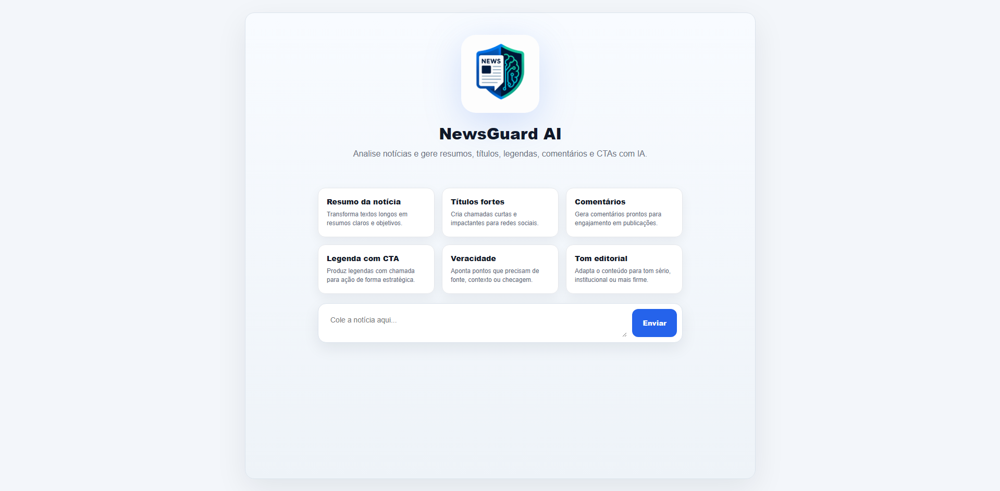
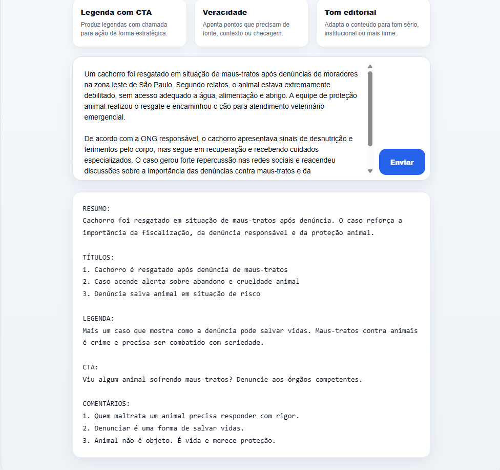

<p align="center">
  
</p>

<h1 align="center">NewsGuard AI</h1>

<p align="center">
AI-powered news analysis and social media automation platform built with Java and Spring Boot.
</p>

---

## Preview

### Home Interface



### AI Analysis



---

## Features

- Automatic news summarization
- AI-generated social media titles
- CTA and caption generation
- Automated comments
- Contextual content analysis
- Social media workflow automation

---

## Technologies

- Java 21
- Spring Boot
- OpenAI API
- HTML/CSS/JavaScript
- Maven
- REST API

---

## Purpose

NewsGuard AI was developed as a practical AI-powered automation platform focused on productivity and content generation for social media workflows.

---

## Run locally

Clone the repository:

```bash
git clone https://github.com/guilhermetxra/newsguard-ai.git
```

Configure your API key:

```properties
openai.api.key=YOUR_API_KEY
```

Run the project:

```bash
mvn spring-boot:run
```

Access:

```text
http://localhost:8080
```